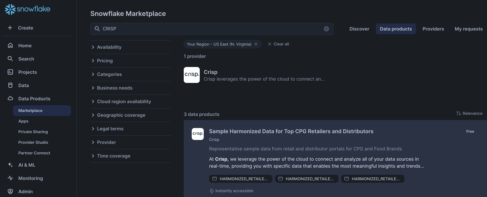
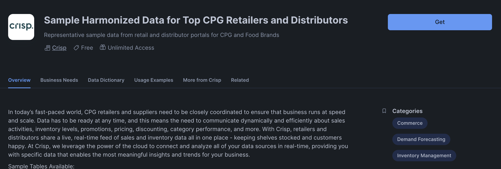
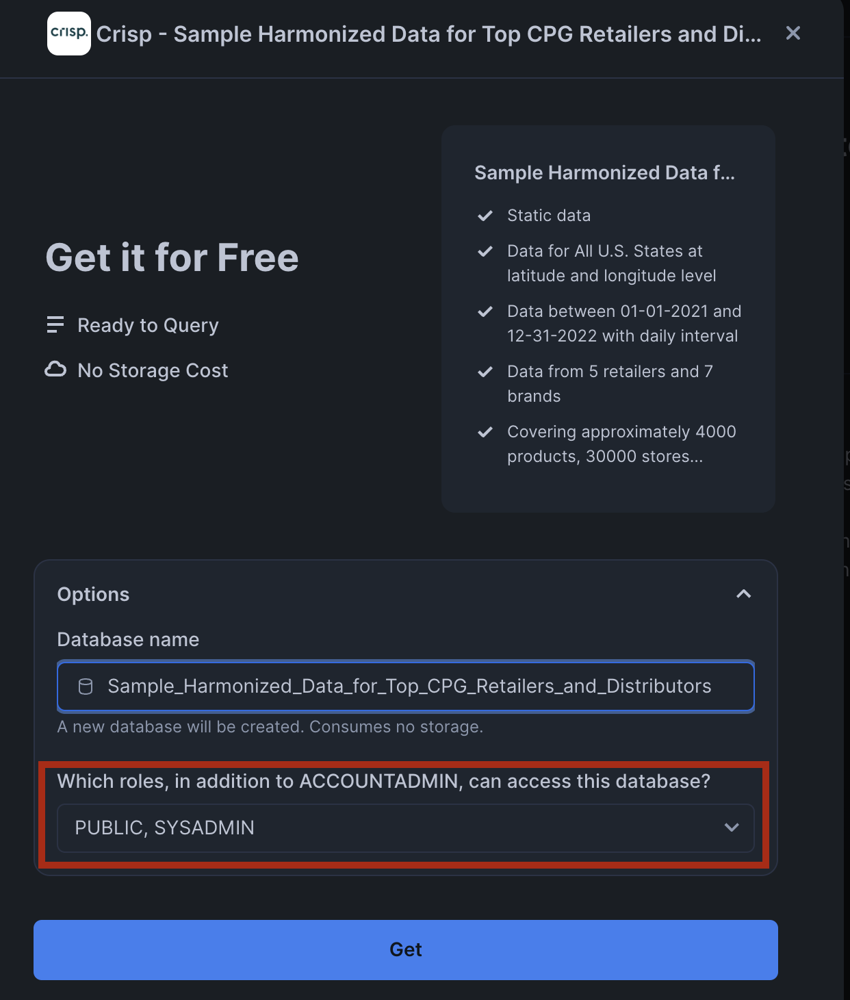
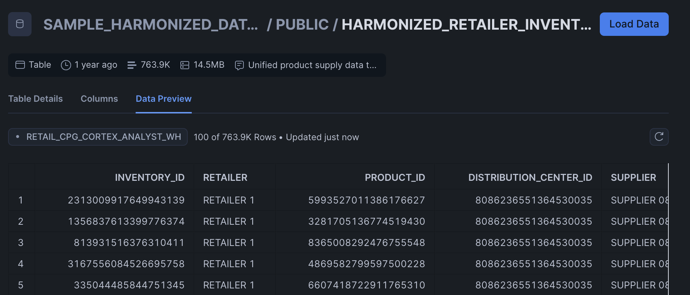

# cortex-analyst

This repo is a quick example on setting up a Snowflake Analyst service based on examples in the below repo:
https://github.com/Snowflake-Labs/sf-samples/tree/main/samples/cortex-analyst

Users will follow the instructions below before building the streamlit.py file in this repo.

## Data Setup
This example uses the CRISP dataset from Snowflake Marketplace that is centered around inventory and demand planning use cases.

Specifically, the Distribution Center Inventory data is used here.

### Create Snowflake objects
Copy & paste the following in a sql worksheet and run all:

```sql
USE ROLE SYSADMIN;

-- Assign Query Tag to Session. This helps with performance monitoring and troubleshooting.
ALTER SESSION SET query_tag = '{"origin":"sf_sit-is","name":"retail_cpg_inventory_cortex_analyst","version":{"major":1, "minor":0},"attributes":{"is_quickstart":0, "source":"sql"}}';

-- Create a new warehouse, database, schema, and stage
CREATE OR REPLACE WAREHOUSE RETAIL_CPG_CORTEX_ANALYST_WH;
CREATE OR REPLACE DATABASE RETAIL_CPG_INVENTORY_DB;
CREATE OR REPLACE SCHEMA RETAIL_CPG_INVENTORY_SCHEMA;
CREATE OR REPLACE STAGE RETAIL_CPG_INVENTORY_STAGE;
```

### Get data on Snowflake Marketplace
:exclamation: Make sure to switch to `SYSADMIN` for the rest of these steps! :exclamation:
#### Steps to access CRISP data on Snowflake Marketplace:

1. Search for `CRISP` in Snowflake Marketplace.


2. Select `Get`


3. Add roles `SYSADMIN` and `PUBLIC`


4. It should be `Ready to Use`


5. Check to see if the tables were populated.


6. Upload the .yaml file in this repo to the stage that we previously created.

## Sample questions to ask
- How much is there in stock for each product for RETAILER 1?
- Which distribution center has the least amount of product stock for RETAILER 1?
- What is my on hand inventory count by geography for RETAILER 1?
- Which distribution center and state has the lowest stock in the East Coast for RETAILER 1?
- Which distribution center and state has the highest stock in the East Coast for RETAILER 1?
